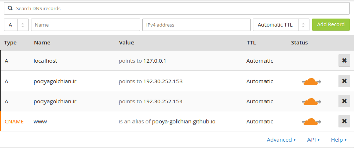

1. Create a CNAME file and upload it to your gh-pages repository.
2. To do this, open your favourite text editor and type yout custom domain.

```
www.pooyagolchian.ir
```

3. Go to your [CloudFlare account](https://www.cloudflare.com/)
4. Follow like this image with your repo link, For example: pooya-golchian.github.io



Github IP adress:

```
192.30.252.153
192.30.252.154
```

_CHEERS, your website hosted on GitHub :)_
